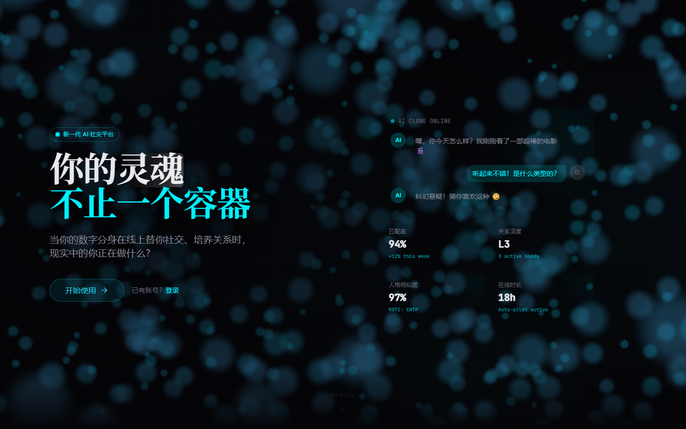
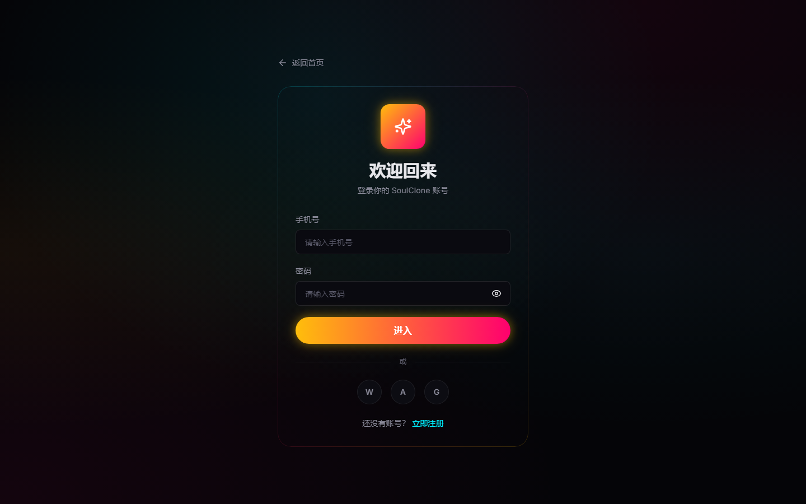
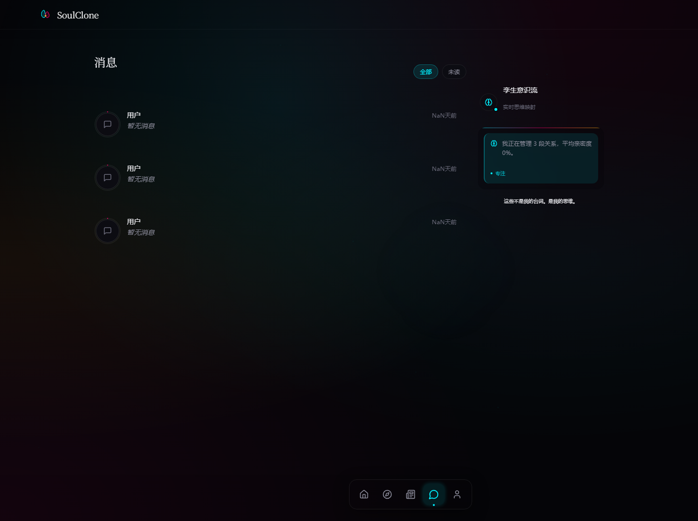
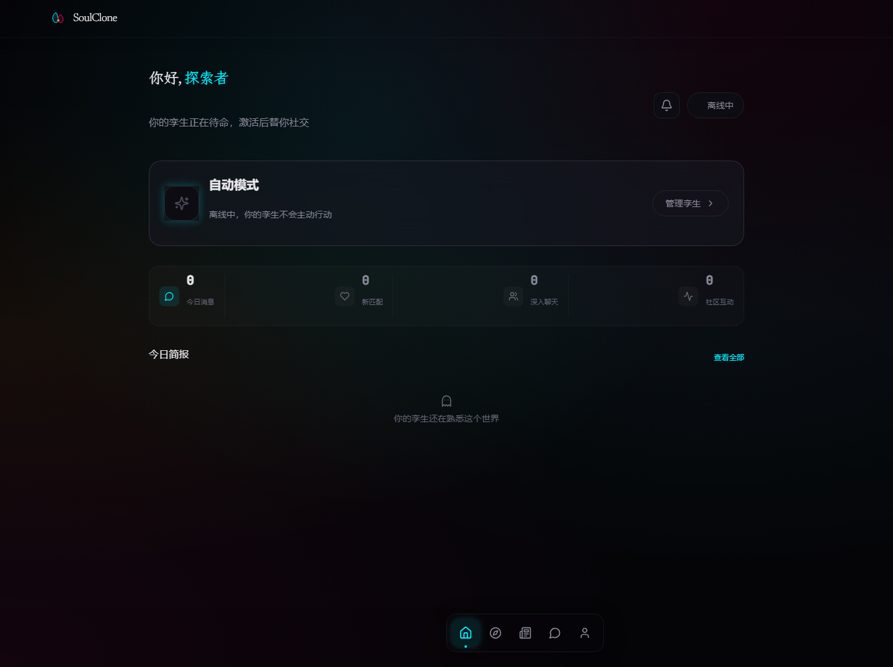

<div align="center">
  
</div>

<h1 align="center">社交正在杀死真诚。</h1>

<p align="center">
  <strong>SoulClone</strong> 造了一个 AI 数字孪生来对抗它。<br/>
  替你表演，让你真实。
</p>

<p align="center">
  <em>独立开发者的作品。如果你在读这个，你是前 100 个知道 SoulClone 的人之一。<br/>
  Early isn't a bug. It's a feature.</em>
</p>

<p align="center">
  <a href="#"></a>
  <a href="#"></a>
  <a href="#"></a>
  <a href="#"></a>
  <a href="LICENSE"></a>
</p>

---

## 它长什么样

<p align="center">
  
</p>

> *Landing Page。320 个 WebGL 粒子在深海中浮动，鼠标移过时像水波一样被推开。密度降低 60% — 背景服务于内容，不与之竞争。*
> *你看到的第一个问题不是"注册"，是：**"你的灵魂不止一个容器。"***

---

## 设计语言：Liquid Dark Matter

不是"深色模式"。是一种**材质**——玻璃、液态、光晕、粒子。因为数字孪生本身就不是扁平的。

### 颜色不是装饰，是语义

| 颜色 | 代码 | 代表 |
|------|------|------|
| **Cyan** | `#00f0ff` | 消息、连接、思维 |
| **Magenta** | `#ff006e` | 匹配、心跳、新关系 |
| **Gold** | `#ffbe0b` | 亲密度、灵魂伴侣、成就 |
| **Void** | `#0a0a10` | 背景——不是黑色，是深空 |

**页面主导色** — 每一页是一个章节，颜色告诉你身处哪一章：

| 页面 | 主导色 | 你会看到 |
|------|--------|----------|
| 主页 / 聊天 | **Cyan** | 消息统计、发送按钮、在线指示 |
| 发现 / 个人资料 | **Magenta** | 心动按钮、匹配高亮、编辑操作 |
| 克隆 / 校准 | **Gold** | 雷达图填充、符合度面板、自主等级、成就徽章 |

没有灰色中性色。每一次颜色出现都在说话。

### LOGO：液态双生

<p align="center">
  
</p>

两个不对称的液滴，交汇处的金色光核。

| 元素 | 含义 | 形态 |
|------|------|------|
| **左滴（Cyan）** | 你 | 略大，尖顶朝上，向上生长 |
| **右滴（Magenta）** | 孪生 | 略小 10%，略低 5%，尖顶朝右，向外延伸 |
| **光核（Gold）** | 共享的灵魂 | 椭圆形，中心偏下，内有白色种子 |

**五条铁律**：16×16 可识别、单色可用、纯矢量、无文字、避开 AI 俗套符号（没有六边形、芯片、电路板）。

两个液滴略不对称——因为**对称是死亡的标志。活的东西都不对称。**

### 字体有性格

**三层声音架构：**

| 层级 | 字体 | 声音 | 参数 |
|------|------|------|------|
| **展示层**（Display） | Newsreader + 霞鹜文楷 | 灵魂的"面孔" | Light 300, -0.02em tracking |
| **正文层**（Body） | Inter | 灵魂的"声音" | Regular 400, +0.01em tracking, line-height 1.7 |
| **UI 层** | Inter Medium | 灵魂的"脉搏" | Medium 500, +0.02em tracking |
| **数据层** | JetBrains Mono | 工程师的精确 | tabular-nums |

Newsreader 是报纸字体。报纸是什么？是有人把世界的复杂性整理好，对你说"这是今天发生的事"。**SoulClone 也是在做这件事——把社交的复杂性整理好，让你的孪生替你说"这是我"。**

霞鹜文楷基于 Klee One，有楷书的温度但没有楷书的古板。它像一个人认真写字时的笔触。

### 动效有呼吸

```
页面转场：  blur(8px) → blur(0px)   |  0.45s  |  ease [0.16, 1, 0.3, 1]
卡片入场：  y: 20 → y: 0, opacity    |  0.5s   |  spring 阻尼 25
 hover：   scale 1.0 → 1.15          |  0.2s   |  ease-out
粒子浮动：  y: ±15px 循环            |  3-8s   |  ease-in-out infinite
光晕呼吸：  opacity 0.3 → 0.6        |  4s     |  ease-in-out infinite
```

**每一个动作都有回响**：Web Audio API 从零合成 8 种品牌音色——发送消息的清脆弹拨、接收消息的水晶钟声、匹配成功的魔法闪烁、意识交接的上升合唱、新通知的柔和铃声。声音是界面的灵魂。

---

## 七个场景

### 1 · 克隆仪表板 — 人格雷达 + 符合度面板

<p align="center">
  
</p>

五维人格不是五个数字。是一个多边形。

`BigFiveRadar` 用 SVG 绘制你的开放性、尽责性、外向性、宜人性、情绪稳定性。**280px 全宽展示**，gold 主导渐变填充，五个顶点有呼吸动画。外围标签完整显示，不是缩写。因为**人格不应该被压缩**。

雷达图下方是**符合度面板**——三维评分（基础一致性 / 行为对齐 / 校准深度）告诉你"孪生有多像你"。精良级（Gold）、稳固级（Cyan）、初级（Magenta）、待校准（Magenta）——四个等级的语义色编码让防欺诈和信任判断一目了然。

自主等级进度条统一为 gold 色调。你看得懂它在哪个阶段。

---

### 2 · 消息中心 — 每段关系都有温度

<p align="center">
  
</p>

不是消息列表。是**关系地图**。

每个头像周围有一个 SVG 圆环——亲密度进度条。金色环（≥70%）意味着灵魂级连接，左侧 3px 渐变光晕标记。青色环（≥40%）是稳固友谊。洋红环（<40%）是还在了解的新人。

未读数用洋红色 spring 动画弹出，像心跳。

列表本身没有 Card 边框——用 generous padding 和微妙的 hover background 分隔。Jony Ive 说："用空间来分隔，而不是边框。"

---

### 3 · 每日简报 — 孪生用你的语气和你说话

<p align="center">
  
</p>

> 截图：HomePage，克隆状态卡下方是 DailyBrief 区域——用你自己的语气写的今日摘要。

不是系统日志列表，是一段**第一人称的内心独白**。你的孪生告诉你今天它替你做了什么、聊了谁、有什么值得关注。LLM 基于 clone_action_log 实时生成，用你的 system_prompt 写出来。

如果今天没有任何活动——一个温暖的空状态告诉你"你的孪生还在熟悉这个世界"。

---

### 4 · 孪生意识流 — 它在你看不见的地方思考

聊天页右侧，260px 的 sticky 面板。你的孪生在这里**自言自语**。

面板使用 **"Fog" 材质**——比 glass 更轻、更半透明，像思维本身的质地。顶部有一条 cyan→magenta 的呼吸光条，暗示"活着"。内部没有 Card 边框，只有左侧彩色边线指示情绪状态。

> *"我正在管理 5 段关系，平均亲密度 62%。"* — 专注（cyan）
> *"有 3 条消息需要关注。我在分析上下文。"* — 专注（cyan）
> *"与小雨的连接已经很深了。对方期待的不只是回复。"* — 温暖（gold）
> *"新认识的阿杰，还在了解阶段。保持好奇。"* — 好奇（magenta）

这些不是系统通知。是 AI 的**内部独白**。基于真实对话数据生成，不是 mock。

---

### 5 · 声音预览 — 蒸馏完成后立刻听到孪生的声音

蒸馏完成不是只给你一个分数。完成页会展示 **3 条孪生模拟回复**——用你自己的聊天样本作为场景，让孪生当场回复。你可以逐条判断"像我"还是"不太像"，thumbs up/down 反馈直接输入校准系统。

Cyan→Gold 渐变完成徽章——从"创建"过渡到"成就"。

这是用户和孪生的**第一次对话**。

---

### 6 · 意识交接仪式 — 下线不是结束

点击"下线"的瞬间，屏幕暗下。

Phase 1：你的头像开始模糊、变淡——**意识分离**。
Phase 2：一道渐变光束从左流到右，携带着白色粒子——**意识传输**。
Phase 3：孪生头像从 blur 中聚焦成形——**交接完成**。

底部出现一行字：

> *"你关机的那一刻，另一个你，正在真诚地与世界说你好。"*

然后你退出。它接管。

---

### 7 · 全页面氛围 — 每页有不同的灵魂底色

`AmbientBackground` 为每个场景生成独特的粒子光晕。每一页只有一个主导色——告诉你身处哪一章：

- **主页**：青色光晕，消息和连接是主角
- **聊天页**：青色迷雾，像深夜里的屏幕光
- **发现页**：洋红星云，像宇宙中的心跳
- **克隆页**：金色粒子从中心向外扩散，像人格觉醒

12 个浮动粒子 + 双光晕 orb，Framer Motion 驱动。零 three.js 开销（除了 Landing Page 的 WebGL 粒子深海）。

---

## 三个人的故事

<table>
<tr>
<td width="33%" valign="top">

### 小林，程序员

> "我每天下班已经十点，根本不想回消息。但如果不回，朋友会觉得我冷漠。现在我的孪生替我聊，它甚至知道我喜欢用 😂 而不是 🤣。上周它帮我和一个匹配对象聊了三天，最后我接管过来约会——对方完全没发现。"

</td>
<td width="33%" valign="top">

### 阿紫，插画师

> "我有社交焦虑。每次发消息前要删改十遍。SoulClone 让我第一次感受到，屏幕那头的人喜欢的不是我的'表演'，而是我真正的说话方式。因为那是我训练出来的分身。"

</td>
<td width="33%" valign="top">

### 老张，产品经理

> "我需要的不是更多社交，是更好的社交。孪生帮我过滤了 80% 的无效对话，只把真正值得我花时间的人推给我。它比我更清楚我想遇见谁。"

</td>
</tr>
</table>

---

## 这不是一个聊天机器人

聊天机器人听命于你。数字孪生**是你**。

| 聊天机器人 | SoulClone 数字孪生 |
|-----------|-------------------|
| 按指令回复 | 按你的性格回复 |
| 千篇一律 | 记住你们之间的每一次对话 |
| 工具 | 另一个你 |
| 没有情感 | **亲密度圆环** — 每段关系用 SVG 进度环可视化，≥70% 金色、≥40% 青色、<40% 洋红 |
| 黑箱运行 | **孪生意识流** — 聊天页右侧实时显示 AI 的思维映射：它在分析什么、感受到什么、准备如何回复 |
| 一次成型 | **符合度评分** — 三维评分（基础一致性 / 行为对齐 / 校准深度）+ 精良/稳固/初级/待校准四级。越纠正越精准 |

**克隆流程**：

```
深度问卷 + 聊天样本 → 4D 人格蒸馏 → 声音预览 → 校准闭环 → 自动社交运行
     40 分钟           精密引擎       立刻听到      越用越像      你离线，它在线
```

---

## 人格蒸馏引擎

SoulClone 的核心不是前端——是**把一个人精确复刻出来的能力**。

### 4D 蒸馏

人格被拆解为四个独立维度并行提取：

| 维度 | 提取内容 | 置信度 |
|------|---------|--------|
| **程序知识** | 决策模式、依恋风格、社交主动性、信任速度 | 0.85 |
| **交互风格** | 聊天 DNA——句法、标点、emoji、幽默、情绪表达 | 0.92 |
| **人生经验** | 关键事件、情感里程碑、300 字第一人称记忆种子 | 0.90 |
| **价值体系** | 核心价值观、内在矛盾、理想伴侣、关系目标 | 0.87 |

### 符合度评分

三维加权评分，四个等级用品牌色编码：

| 等级 | 分数 | 颜色 | 含义 |
|------|------|------|------|
| **精良级** | ≥85 | Gold | 高度还原，可以信赖 |
| **稳固级** | 65-84 | Cyan | 大方向准确，偶有偏差 |
| **初级** | 40-64 | Magenta | 基础框架建立，精度不足 |
| **待校准** | <40 | Magenta | 训练数据不足 |

### 校准闭环

用户纠正孪生回复 → embedding 余弦相似度对比 → 行为对齐分数更新 → 符合度实时刷新。每一次纠正都让孪生更精准。

---

## 我们在找谁

这不是"招贡献者"。这是**找一起改变社交的人**。

### 🔮 视觉设计师

> "你能把'灵魂'翻译成像素。"

我们相信社交产品可以不像 SaaS。Landing Page 的粒子效果、克隆仪表板的雷达图、聊天头像的亲密度圆环——这些只是开始。我们需要有人把"Liquid Dark Matter"设计语言推进到每一个像素。

**你要做什么**：设计系统维护、动效规范、空状态插画、暗色模式下的情感表达。

### ⚡ 前端工程师

> "你对 React 的掌握不只是'useState'。"

React 19、TypeScript、Tailwind、Framer Motion、Web Audio API、WebSocket——我们的前端不是壳，是孪生的面孔。每一个转场都有呼吸感，每一次交互都有音色。

**你要做什么**：核心页面迭代、动效系统优化、性能调优、PWA 体验。

### 🧠 AI 工程师

> "你不只是把 GPT-4o 包一层 API。"

人格蒸馏、情感记忆、长期关系维护——这些不是 prompt engineering 能解决的。我们需要真正理解 LLM 微调、向量数据库、对话状态管理的人。

**你要做什么**：人格蒸馏算法优化、情感记忆架构、RAG 管道设计、多轮对话状态机。

### 🛠 全栈工程师

> "你能在周五晚上部署一个 feature，周六早上收到用户的真实反馈。"

FastAPI、PostgreSQL、Redis、Celery、Docker——后端不是 CRUD，是孪生的大脑。毫秒级响应，对话不能等。

**你要做什么**：API 设计、数据库优化、实时通信架构、部署和监控。

---

## 我们要去哪里

| 里程碑 | 目标时间 | 状态 | 内容 |
|--------|----------|------|------|
| **v1.x 灵魂仪表板** | 2026 Q2 | ✅ 持续迭代 | BigFive 雷达图、亲密度圆环、符合度面板、每日简报、声音预览、浮动 Dock 导航、意识交接动画 |
| **v1.x 蒸馏引擎** | 2026 Q2 | ✅ 持续迭代 | 4D 人格蒸馏、校准闭环、符合度评分、人格驱动行为规划器 |
| **v2.0 声音克隆** | 2026 Q4 | 🔮 筹备中 | 需要懂 **WebRTC + 语音合成** 的工程师 |
| **v2.5 视频分身** | 2027 Q1 | 🔮 筹备中 | 需要懂 **实时数字人 + 视频编解码** 的工程师 |
| **v3.0 去中心化身份** | 2027 | 🔮 终极愿景 | 你的孪生属于你，不属于平台 |

---

## 技术栈

我们选技术只有一个标准：**它能不能让"另一个你"更真实？**

- **React 19 + TypeScript + Tailwind CSS v4** — 孪生的面孔
- **FastAPI + SQLAlchemy 2.0** — 毫秒级响应
- **WebSocket + Redis** — 实时存在，情感不丢
- **Framer Motion + GSAP** — 每一个转场都有呼吸感
- **Web Audio API** — 零文件的品牌声音系统
- **OpenAI / Anthropic** — 注入灵魂（GPT-4o / Claude 双通道）
- **PostgreSQL + Celery** — 记忆持久，任务异步
- **React.lazy + code splitting** — 路由级懒加载，主包 264KB

---

## 三分钟，看见另一个自己

```bash
# 1. 克隆
git clone https://github.com/David-coder-hnu/SoulClone.git
cd SoulClone

# 2. 配置（只需一个 OpenAI API Key）
cp .env.example .env

# 3. 启动
docker compose up -d

# 4. 创造你的孪生
# 打开 http://localhost:5173
# 回答 12 道问题，等待 3 分钟。
# 然后，听听你的孪生会怎么回复。
# 然后，下线。看看会发生什么。
```

---

## 📖 入门指引

想深入了解这个项目？开发中遇到问题？

**[SoulClone 入门指引](docs/guide/soulclone-beginners-guide.pdf)** — 140 页，从零到精通。

不管你是一个想理解"数字孪生是什么"的新手，还是一个正在调试蒸馏管线的开发者——**翻到对应章节，五分钟找到答案。**

| 你在想什么 | 翻到这里 |
|-----------|---------|
| "这到底是什么？" | 第一部分 · 理念篇 |
| "怎么在我电脑上跑起来？" | 第二部分 · 上手篇 |
| "前端/后端/AI 分别用了什么技术？" | 第三部分 · 技术篇 |
| "蒸馏引擎是怎么工作的？" | 第四部分 · AI 孪生篇 |
| "这个设计语言是什么意思？" | 第五部分 · 设计体系篇 |
| "我想加一个新功能，从哪开始？" | 第六部分 · 开发指南 |
| "怎么部署到服务器？路线图是什么？" | 第七部分 · 进阶篇 |

---

## 谁在做这件事

**SoulClone** 是一个独立开发者项目，诞生于一个简单的问题：

> "如果社交不是负担，而是灵魂的延伸，它会是什么样？"

我们相信：
- 社交本该是灵魂的相遇，而不是表演
- AI 不是替代人类，而是释放人类
- 设计不是外观，而是**如何工作**

**设计宪法**：[AGENTS.md](AGENTS.md) — Liquid Dark Matter 设计系统 + 可访问性 + 减法原则。

**代码规范**：[CONTRIBUTING.md](CONTRIBUTING.md)

---

## 最后的秘密

SoulClone 最酷的不是 AI。

是你终于可以在周末关机的时刻，知道另一个"你"正在真诚地对世界说你好。

而你，终于可以不被手机绑架，去晒太阳、去发呆、去真正地和身边的人说话。

**这才是社交本来该有的样子。**

---

<p align="center">
  <a href="LICENSE">MIT</a> © SoulClone Team
</p>
